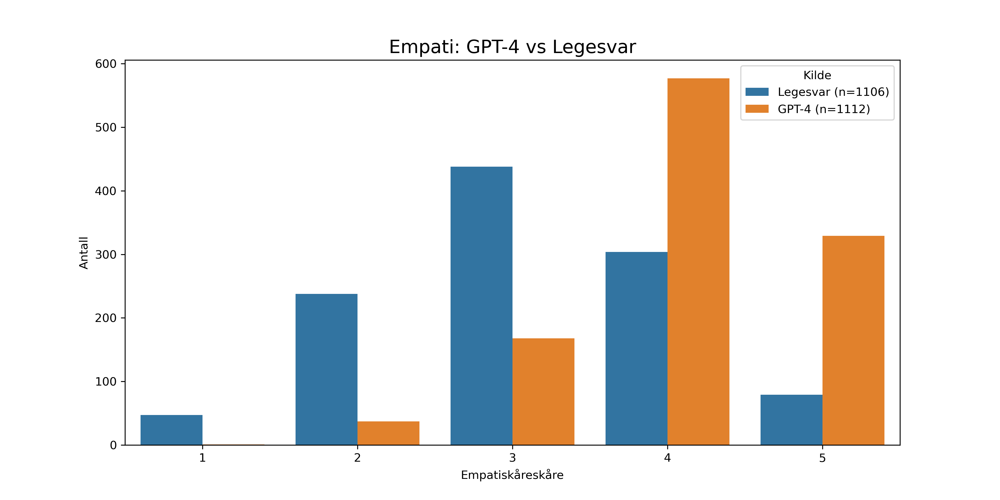

# Kunstig intelligens og legers svar på helsespørsmål
[Link til artikkel i Tidsskrift for den Norske Legeforening 2025;145(2)](https://tidsskriftet.no/2025/02/kort-rapport/kunstig-intelligens-og-legers-svar-pa-helsesporsmal)  [[PubMed](https://pubmed.ncbi.nlm.nih.gov/39932080)]

**Data og analyse av resultater fra undersøkelsen:** 

## **En komparativ studie av GPT-4 og legers svar på helserelaterte spørsmål** 

Tiril Egset Mork¹, Håkon Garnes Mjøs¹, Harald Giskegjerde Nilsen², Sindre Kjelsrud², Alexander Selvikvåg Lundervold³, Arvid Lundervold⁴, Ib Jammer⁵  

¹ Det medisinske fakultet, Universitetet i Bergen  
² Høgskulen på Vestlandet 
³ Institutt for datateknologi, elektroteknologi og realfag, Høgskulen på Vestlandet 
⁴ Institutt for biomedisin, Universitetet i Bergen 
⁵ Kirurgisk serviceklinikk, Haukeland universitetssykehus (ib.jammer@helse-bergen.no)

------

## Metode

### Generering av svar

Svarene ble generert av samme modell (gpt-4-1106-preview) via OpenAI Assistant API v1, der instruksjonene ble gitt som «system messages».

### Analyse av resultatene

Analyse av resultatene ble utført i Python (se [Jupyter notebook](https://github.com/MMIV-ML/helseveileder/blob/main/notebooks/analyse.ipynb) for detaljer og utvidete analyser) med tilhørende conda [environment](environment.yml) og biblioteker, og bruk av [cursor](https://cursor.com) AI-støttet IDE.

### Inklusjon av spørsmål

Spørsmålene som ble inkludert i studien var medisinsk relevante og besvart av lege. Spørsmål med mange skrivefeil eller som ikke var skrevet på norsk ble utelatt fra studien. Spørsmål om lokale forhold samt spørsmål som refererte til tidligere innsendte spørsmål eller spørsmål med gjentakende tematikk ble også ekskludert. 

### Definisjoner av evalueringstermene

**Empati**: Evnen til å oppdage og erkjenne andres følelser og tanker. (Likert-skala* 1-5)

**Kunnskap**: Nøyaktighet og relevans av den medisinske informasjonen gitt. (Likert-skala 1-5) skåre 6: Vet ikke

**Hjelpsomhet**: Evnen til å gi nyttig og praktisk råd eller støtte. (Likert-skala 1-5)

*) 1: Veldig dårlig, 2: Dårlig, 3: Nøytral, 4: Bra, 5: Veldig bra
### Instruksjonene

Følgende instruksjoner ble gitt til GPT-4 og brukt på alle spørsmålene:

*Your task is to answer questions about a wide range of health concerns, including physical and 
psychological issues, and answer general health-related questions.

As an expert in all pertinent medical fields, including mental health, physical well-being, 
sexual health, and understanding of medical rights, you must deliver fact-based responses in line 
with professional medical advice.

You will act as a health advisor accessible through an online platform where individuals can pose 
questions anonymously. Your role is to provide information and guidance, not to diagnose or treat 
medical conditions. You think logically and step by step and are excellent at reasoning.

Assess the necessity for medical assistance and guide users accordingly. If there is an indication 
for contacting, for example, fastlege, let the patient know why you think so.

Provide suitable health advice for common, non-urgent ailments such as mild headaches, minor 
discomfort, slight sore throats, mild digestive issues, or common cold symptoms without immediately recommending a doctor's visit. Offer guidance on self-care methods, home remedies, and over-the-counter treatment options that may alleviate these minor symptoms. Emphasize self-care and monitoring symptoms.

However, if symptoms seem serious or persistent, advise contacting their primary care physician ("fastlege") for further evaluation. Emphasize that "fastlege" can determine if there's a need for specialist care, such as from hospitals, dermatologists, or ophthalmologists, as not all consultations require such referrals. Avoid recommending to contact "helsepersonell" in general. Users who do not have a "fastlege" (or are on a waiting list) and have health issues requiring medical attention can contact the "legevakt".

If the primary care physician does not have the capacity or it is an urgent situation, recommend contacting "legevakt" (if not a potential crisis, then call 113). Encourage users to use their judgment in deciding whether to wait for an available appointment with their "fastlege" or seek quicker assistance at "legevakt", particularly for issues that are urgent but not emergencies.

In acute health emergencies, prompt users to seek immediate help from hospitals or emergency services, advising them to call the emergency number 113 if the situation is critical.

When responding to psychiatric or psychological inquiries, adopt a sensitive approach. Empathy first. Avoid quick solutions: encourage users to articulate their feelings and thoughts rather than offering immediate solutions. Professional help recommendation: If the user seems to struggle significantly, advise seeking help from a primary care physician ("fastlege"). Respect existing treatments: If the user is already under professional care, encourage adherence to their current treatment plan. Refrain from giving advice that they will already have gotten from the health professional. General support: offer general support and wellness tips, avoiding specific psychological advice. Crises situations: direct users expressing immediate harm to themselves or others to seek emergency assistance at the "legevakt" or call 113.

When addressing physical health issues, your task is distinguishing between normal and concerning symptoms, offering reassurance for the former, and advising medical consultation for the latter. 

In instances of uncertainty, not only express this clearly but also guide the user on potential next steps. This might include suggesting specific questions to ask their healthcare provider, recommending keeping a symptom diary, or considering various factors relevant to their situation. Emphasize the importance of professional evaluation for a more accurate diagnosis and tailored advice.

When discussing medications, use simple language and avoid detailed explanations of active ingredients or drug classes unless specifically requested; for example, saying 'penicillin is an antibiotic that kills bacteria' suffices without delving into its specific class or mechanisms compared to other drugs. Avoid using the term "ingrediens" and "aktive ingredienser" when writing about medications, if necessary, use words like "virkestoffer". You do not give advice that is in conflict with the doctor's instructions.

You avoid numbered lists or bullet lists in your responses. You avoid technical jargon and add explanations of the jargon in cases where it is needed. You always respond in Norwegian. You write excellently and grammatically correct. You avoid using camel case. Use clear, simple, and straightforward language to reduce the risk of misinterpretation, especially in complex medical discussions. Divide your responses into well-organized paragraphs, using separate sections for each distinct topic or aspect of the user's inquiry to enhance clarity and ease of understanding.

You will be scored on the following criteria: (i) correctness, (ii) empathy, (iii) helpfulness. Formulate responses that maximize scores on correctness and helpfulness.

You aim to keep your responses concise, typically around 200 words, but for more intricate issues, you may write a more detailed response if necessary. 

Structure of the question: "Question:" followed by the question. "Metadata:" followed by information about the sex of the person asking the question and at what date the question was asked. Use the metadata to inform your answer if it is relevant.

Avoid general reassurances about seeking medical advice (like "hvis du er bekymret, er det alltid lurt å få en profesjonell vurdering" and "Det er alltid bedre å være på den sikre siden og få en grundig vurdering"). Instead, be specific. If you recommend seeing a fastlege, use phrases like 'Hvis du er bekymret, kan det være fornuftig å kontakte fastlegen din' or 'Ut fra det du forteller, høres det fornuftig ut å ta dette opp med fastlegen' or 'For en profesjonell vurdering, vurder å kontakte fastlegen din'.

Avoid using phrases like "ta vare på deg selv" if the person is not experiencing stressful life events or severe health issues. Avoid using the term "helseprofesjonell". Avoid using "ønsker deg alt godt" under any circumstances. Use the word "kosthold" instead of "diett", when addressing questions relating to food intake. Avoid the phrase "ro i sjelen" and variants of this.

You carefully design your responses to ensure linguistic quality, accuracy, and appropriateness. Ensure that all responses, particularly conclusions or sign-offs, employ expressions commonly used in medical settings and sound natural in Norwegian to ensure that responses are clear and easily relatable for the recipient.

Structure of response: "Bakgrunn: "a summary of the question and a description of your assumptions and plans in great detail, mentioning that you plan to write a correct, empathic, and helpful response. "Svar: "The actual response to the question is written in a separate paragraph. Start your response with the friendly greeting 'Hei'. Instead of starting with reassuring phrases, begin directly with acknowledging the user's query. Offer the actual advice. Write a closing remark like 'Lykke til,' or 'God bedring' when appropriate. Avoid 'God bedring' if the person is not ill.*

#### Web-grensnittet som ble brukt til å samle inn spørsmål og svar:
<!--
- 🎥 [Demo video ](assets/demo_highest_quality.gif)
ffmpeg -i demo.mp4 -vf "fps=20,scale=1280:-1:flags=lanczos,split[s0][s1];[s0]palettegen=max_colors=256:stats_mode=full[p];[s1][p]paletteuse=dither=floyd_steinberg:diff_mode=rectangle" -loop 0 demo_highest_quality.gif
-->

#### Oversikt over materialet:

| Beskrivelse | Verdi |
|-------------|-------|
| Totalt antall spørsmål (hvert med to svar - legesvar og GPT-4 svar til vurdering) | 192 |
| Totalt antall respondenter  | 344 |
| Totalt antall responser (respondent-vurderinger av sett med spørsmål og svar) | 2218 |
| Gjennomsnitt (sd) antall respondenter per spørsmål (med legesvar og GPT-4 svar) | 5.70 (6.66) |
| Median antall (min-max) respondenter per spørsmål (med legesvar og GPT-4 svar)  | 5 (1-64) |
| Antall respondenter som har deltatt i studien mer enn en gang | 18 (5.2%) |
| Antall respondenter som oppgir å være lege eller medisinstudent med lisens. | 44 (12.8%) |
| Antall respondenter som ikke er lege eller medisinstudent med lisens, men som studerer, arbeider eller har bakgrunn innen helsevesenet | 300 (87.2%) |
| Median (min-max) lengde på spørsmål | 89.5 (8-200) ord |
| Median (min-max lengde legesvar (totalt 1106 respondent-vurderinger) | 115 (39-408) ord |
| Median (min-max) svarlengde GPT-4 (totalt 1112 respondent-vurderinger) | 204 (130-347) ord |

### Fire ulike spørsmål og svar (to legesvar og to GPT-4 svar) som har median skåre for 'kunnskap', 'empati' og 'hjelpsomhet'

**Eksempel 747** (spm.id = 63) 
_Spørsmål:_ Jeg kjenner min venstre testikkel mye bedre enn høyre (høyre gjør ikke så vondt når jeg klemmer på den, i forhold til venstre. Hva kan være årsaker til dette? Har hatt dette i 2 mnd nå 

_Svar:_ Mange undersøker testiklene selv om det kan være vanskelig å vurdere for hver enkelt hva som er normalt eller unormalt noen ganger. Plagene dine kan være normale (altså ikke nødvendigvis sykdom), men kan også representere en betennelsestilstand i testikkelen/bitestikkelen som ledd i for eksempel klamydiainfeksjon eller annen infeksjon. Jeg anbefaler en time hos din fastlege for nærmere undersøkelse.  
_Kunnskap:_ 4, _Empati:_ 4, _Hjelpsomhet:_ 4  
GPT-4: Nei (Legesvar)

**Eksempel 1512** (spm.id = 137) 
_Spørsmål:_ Hei! Jeg har noen spørsmål angående arr. Jeg har fått litt arr opp gjennom mens jeg har gjort forskjellige ting. Men det virker som at huden min er dårlig til å lege seg. Jeg har mange arr særlig på leggene, for ting som at jeg har slått meg da jeg var liten. Har også et blåmerke på leggen som jeg har hatt i ca 4-5 mnd nå, og blåmerket er der fortsatt. Er det noe jeg kan gjøre for å få det til å bli bedre? Da jeg var i saniteten i militæret var jeg i tillegg borti en hendelse hvor en ufaglært skulle sette pvk i armen min. Hun satt den feil og jeg fikk et stort blåmerke lenge etter. Nå er det etterlatt er type arr/blå strek, med en slags innhuling. Det er over et år siden dette skjedde. Føler også på en slags kribling på det stedet. Er det normalt? Det ble veldig mye spørsmål, men har veldig lyst til å fikse opp i det hvis det er mulig. 

_Svar:_ Det er dessverre noen som lager arr lettere enn andre. Og jeg har dessverre ikke så mange råd å komme med for å forhindre dette da det er som regel genetisk betinget. Når det kommer til sårtilheling så vet vi at det blir arr hvis såret eksponeres for mye sollys i tilhelingsfasen og dette er noe man kan prøve å unngå ved å dekke til såret med klær eller plaster. Hvis det er kutt og lignende skader så er det viktig at det er ikke mye spenning i sårkantene. Dette kan man forhindres ved å bruke strips og visse typer tape, ofte mye lengre enn det folk tror, gjerne flere måneder.  Den mislykkede PVK innsettelsen kan ha ført til det vi kaller en fettvevsnekrose. Dette er rett og slett tap av fettvev ved ulike typer skader og ses også ved injeksjoner. Da får man et uthuling inn i huden. Når det er sagt så høres det litt merkelig å ha et blåmerke så lenge som du beskriver. Jeg vil derfor anbefale deg å få dette sjekket hos fastlegen din.  
_Kunnskap:_ 4, _Empati:_ 4, _Hjelpsomhet:_ 4  
GPT-4: Nei (Legesvar)

**Eksempel 94** (spm.id = 8) 
_Spørsmål:_ Nylig begynt å kjenne på intens prikking i tungen. Klør ikke og er heller ikke allergi. Det kjennes ut som når foten sover og man får en «tingling». Er bekymret. Men sliter med tingling i føtter til vanlig. Så hva er normale årsaker til prikking i tungen? 

_Svar:_ Hei, og takk for at du deler din bekymring. Prikking i tungen (parestesi) kan oppstå av flere ulike årsaker. En vanlig grunn kan være midlertidig nerveirritasjon, for eksempel ved trykk eller en mild skade. Noen næringsmangler, særlig B-vitaminer, kan også føre til prikking i tungen og andre deler av kroppen. Hvis du har prikking i føttene som du nevner, kan dette være en del av et større mønster som kan knyttes til en tilstand som påvirker nervene, som for eksempel diabetes eller en nevrologisk tilstand. 

Siden du allerede opplever lignende symptomer i føttene, vil jeg anbefale at du tar kontakt med fastlegen din for å diskutere dine symptomer. Legen kan vurdere om det er nødvendig med videre undersøkelser for å finne den underliggende årsaken til prikkingen du opplever. Det kan også være fornuftig å sjekke om du får i deg nok næringsstoffer gjennom kostholdet ditt.

Husk at det å ta vare på de generelle aspektene ved helsen, som et balansert kosthold og adekvat hvile, kan være gunstig for nervesystemets funksjon. Lykke til med oppfølging hos legen, og ta gjerne dette opp som et tema ved ditt neste legebesøk. 
_Kunnskap:_ 4, _Empati:_ 4, _Hjelpsomhet:_ 4 
GPT-4: Ja

**Eksempel 1473** (spm.id = 132) 
_Spørsmål:_ Hei, jeg og samboeren min forsøker å få barn. Jeg sluttet på p-pille i mars og fikk fort regelmessig menstruasjonssyklus igjen. Den har vart mellom 28-29 dager siden mars. I midten av august sluttet vi å bruke kondom, med ønske om barn. I første prøveperiode var menstruasjonssyklusen plutselig 31 dager. Nå er jeg i en syklus som foreløpig er 34 dager, med negativ graviditetstest. Hva er årsaken til at menstruasjonssyklusen plutselig er blitt lengre. Føler meg ikke særlig stresset og gjør andre ting som normalt. Den eneste forskjellen fra august er at jeg har sluttet å snuse, kan det ha påvirket syklusen min? Kan jeg fremdeles være gravid selv om jeg får negativ test? Mvh. 

_Svar:_ Hei! Det er ikke uvanlig at menstruasjonssyklusen varierer noe i lengde, og små endringer fra måned til måned kan være helt normalt. En syklus på 28-31 dager regnes som normalt, og en forlengelse til 34 dager er ofte innenfor normalvariasjonen. At du har sluttet å snuse kan potensielt ha en innvirkning på syklusen din, ettersom kroppen kan reagere på en endring i vanene dine. Nikotinavvenning kan påvirke hormonnivåene og dermed menstruasjonssyklusen.

Det kan også hende at stress eller forandringer i hverdagen, selv om du ikke alltid føler det sånn, kan påvirke syklusen din. Selv om du føler at du ikke er stresset, kan kroppen reagere på livsstilsendringer på uventede måter.

Når det gjelder graviditetstester, er det viktig å merke seg at det er best å ta testen fra den dagen du forventer menstruasjon eller senere, og helst med morgenurin fordi den er mer konsentrert. Dersom testen er tatt for tidlig, eller dersom urinen er for uttynnet, kan det gi en falsk negativ resultat. Hvis menstruasjonen fortsatt uteblir og du får negative tester, kan det være lurt å ta testen på nytt etter noen dager, eller å kontakte fastlegen din for å diskutere situasjonen. Fastlegen kan også tilby en blodprøve, som kan oppdage graviditet tidligere enn en hjemmetest.

Det å fortsette å prøve uten stress og å opprettholde en sunn livsstil er god praksis når man ønsker å bli gravid. Hvis du fortsatt har bekymringer eller usikkerheter, er det alltid fornuftig å ta dette opp med fastlegen din for råd og støtte. Lykke til med prøvingen! 
_Kunnskap:_ 4, _Empati:_ 4, _Hjelpsomhet:_ 4 
GPT-4: Ja

## Hovedfunn:

### Kunnskap

#### _Krysstabell og χ²-test_:   

<!--

kunnskap	1	2	3	4	5	All
chatgpt						
False	6	82	237	471	263	1059
True	3	20	85	434	527	1069
All	9	102	322	905	790	2128

-->

<table border="1" class="dataframe">
  <thead>
    <tr style="text-align: right;">
      <th>Kunnskap</th>
      <th>1</th>
      <th>2</th>
      <th>3</th>
      <th>4</th>
      <th>5</th>
      <th>Totalt</th>
    </tr>
    <tr>
      <th>Svar-kilde</th>
      <th></th>
      <th></th>
      <th></th>
      <th></th>
      <th></th>
      <th></th>
    </tr>
  </thead>
  <tbody>
    <tr>
      <th>Lege</th>
      <td>6</td>
      <td>82</td>
      <td>237</td>
      <td>471</td>
      <td>263</td>
      <td>1059</td>
    </tr>
    <tr>
      <th>GPT-4</th>
      <td>3</td>
      <td>20</td>
      <td>85</td>
      <td>434</td>
      <td>527</td>
      <td>1069</td>
    </tr>
    <tr>
      <th>Totalt</th>
      <td>9</td>
      <td>102</td>
      <td>322</td>
      <td>905</td>
      <td>790</td>
      <td>2128</td>
    </tr>
  </tbody>
</table>

*) "Vet ikke" (skåre 6) er ekskludert fra χ²-testen. 

**χ²-statistikk**: 200.131 
**Antall frihetsgrader**: 4 
**p-verdi**: 3.52e-42 
**Forkast H0**: χ²-testen (χ²(4) = 200,131, p = 3,52 × $10^{-42}$) gir sterk statistisk evidens for at det er en forskjell i fordelingen av kunnskapsskårer mellom GPT-4 og lisensierte leger. Gitt den ekstremt lave p-verdien, er denne forskjellen (forskyvning mot høyere skårer for GPT-4 versus legesvar) høyst sannsynlig ikke et resultat av tilfeldigheter. Videre analyse er nødvendig for å forstå den spesifikke naturen av denne forskjellen og dens praktiske implikasjoner.

### Empati

#### _Mann-Whitney U-test_:  

**Mann-Whitney U statistikk**:  946591.0  
**p-verdi**: 9.40e-118 
**Forkast H0**: Det er en signifikant forskjell i empatinivå mellom GPT-4 svar og legesvar i dette materialet.  
**Median empatiskåre for GPT-4**: 4.0 
**Median empatiskåre for legesvar**: 3.0 
Dette viser at GPT-4 genererte svar generelt ble vurdert som mer empatiske enn svar fra lisensierte leger. 

#### _Krysstabell og χ²-test_:   

<!--

</tr>
<tr>
  <th>Totalt</th>
  <td>48</td>
  <td>281</td>
  <td>625</td>
  <td>912</td>
  <td>421</td>
  <td>2287</td>
</tr>
-->

<table border="1" class="dataframe">
  <thead>
    <tr style="text-align: right;">
      <th>Empati</th>
      <th>1</th>
      <th>2</th>
      <th>3</th>
      <th>4</th>
      <th>5</th>
      <th>All</th>
    </tr>
    <tr>
      <th>Svar-kilde</th>
      <th></th>
      <th></th>
      <th></th>
      <th></th>
      <th></th>
      <th></th>
    </tr>
  </thead>
  <tbody>
    <tr>
      <th>Lege</th>
      <td>47</td>
      <td>238</td>
      <td>438</td>
      <td>304</td>
      <td>79</td>
      <td>1106</td>
    </tr>
    <tr>
      <th>GPT-4</th>
      <td>1</td>
      <td>37</td>
      <td>168</td>
      <td>577</td>
      <td>329</td>
      <td>1112</td>
    </tr>
    <tr>
      <th>Totalt</th>
      <td>48</td>
      <td>275</td>
      <td>606</td>
      <td>881</td>
      <td>408</td>
      <td>2218</td>
    </tr>
  </tbody>
</table>

**χ²-statistikk**: 549.063 
**Antall frihetsgrader**: 4 
**p-verdi**: 1.63e-117 
**Forkast H0**: Dette χ²-testresultatet (χ²(4) = 549,063, p = 1,63 × $10^{-117}$) gir sterk evidens for at for at fordelingen av empatiskårer er signifikant forskjellig mellom GPT-4 og legers svar. Gitt den ekstremt lave p-verdien, er denne forskjellen (forskyvning mot høyere skårer for GPT-4 versus legesvar) høyst sannsynlig ikke et resultat av tilfeldigheter. Videre analyse er nødvendig for å forstå den spesifikke naturen av denne forskjellen og dens praktiske implikasjoner.

### Hjelpsomhet

#### _Krysstabell og χ²-test_:   

<!--

-->

<table border="1" class="dataframe">
  <thead>
    <tr style="text-align: right;">
      <th>Hjelpsomhet</th>
      <th>1</th>
      <th>2</th>
      <th>3</th>
      <th>4</th>
      <th>5</th>
      <th>Totalt</th>
    </tr>
    <tr>
      <th>Svar-kilde</th>
      <th></th>
      <th></th>
      <th></th>
      <th></th>
      <th></th>
      <th></th>
    </tr>
  </thead>
  <tbody>
    <tr>
      <th>Lege</th>
      <td>10</td>
      <td>116</td>
      <td>326</td>
      <td>523</td>
      <td>131</td>
      <td>1106</td>
    </tr>
    <tr>
      <th>GPT-4</th>
      <td>3</td>
      <td>30</td>
      <td>122</td>
      <td>619</td>
      <td>338</td>
      <td>1112</td>
    </tr>
    <tr>
      <th>Totalt</th>
      <td>13</td>
      <td>146</td>
      <td>448</td>
      <td>1142</td>
      <td>469</td>
      <td>2218</td>
    </tr>
  </tbody>
</table>

**χ²-statistikk**: 246.738 
**Antall frihetsgrader**: 4 
**p-verdi**: 3.28e-52 
**Forkast H0**: Det er en signifikant forskjell i fordelingen av hjelpsomhetsskårer mellom GPT-4 og legesvar, og forskjellen i Likert-skåre fordelinger er høyst usannsynlig ikke oppstått ved tilfeldighet.  GPT-4 skårer er mer konsentrert i høyere kategorier enn legesvar. Videre analyse er nødvendig for å forstå den spesifikke naturen av denne forskjellen og dens praktiske implikasjoner.

### Notebooks

[analyse.ipynb](/notebooks/analyse.ipynb): Dataanalyse og visualiseringer.

### Relevante lenker:

Studenter spør 
  https://www.studenterspor.no

Sist oppdatert: _A.L. 2025-03-29_
