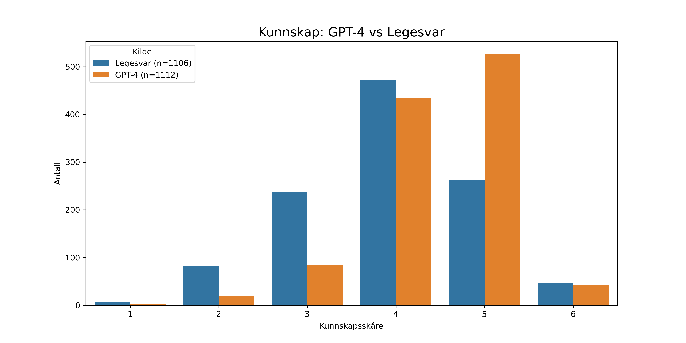

# Helseveileder
[Under etablering ...]

**Data og analyse av resultater fra undersøkelsen:** 

## **En komparativ studie av GPT-4 og legers svar på helserelaterte spørsmål** 

Tiril Egset Mork¹, HÃ¥kon Garnes Mjøs¹, Harald Giskegjerde Nilsen², Sindre Kjelsrud², Alexander SelvikvÃ¥g Lundervold³, Arvid Lundervoldâ´, Ib Jammerâµ  

¹ Det medisinske fakultet, Universitetet i Bergen  
² Høgskulen på Vestlandet 
³ Institutt for datateknologi, elektroteknologi og realfag, Høgskulen på Vestlandet 
â´ Institutt for biomedisin, Universitetet i Bergen 
âµ Kirurgisk serviceklinikk, Haukeland universitetssykehus (ib.jammer@helse-bergen.no)

------

<!--
- 🥠[Demo video ](assets/demo_highest_quality.gif)
ffmpeg -i demo.mp4 -vf "fps=20,scale=1280:-1:flags=lanczos,split[s0][s1];[s0]palettegen=max_colors=256:stats_mode=full[p];[s1][p]paletteuse=dither=floyd_steinberg:diff_mode=rectangle" -loop 0 demo_highest_quality.gif
-->

### Fire ulike spørsmål og svar (to legesvar og to GPT-4 svar) som har median skåre for 'kunnskap', 'empati' og 'hjelpsomhet'

**Eksempel 747:** 
_Spørsmål:_ Jeg kjenner min venstre testikkel mye bedre enn høyre (høyre gjør ikke så vondt når jeg klemmer på den, i forhold til venstre. Hva kan være årsaker til dette? Har hatt dette i 2 mnd nå 

_Svar:_ Mange undersøker testiklene selv om det kan være vanskelig å vurdere for hver enkelt hva som er normalt eller unormalt noen ganger. Plagene dine kan være normale (altså ikke nødvendigvis sykdom), men kan også representere en betennelsestilstand i testikkelen/bitestikkelen som ledd i for eksempel klamydiainfeksjon eller annen infeksjon. Jeg anbefaler en time hos din fastlege for nærmere undersøkelse.  
_Kunnskap:_ 4, _Empati:_ 4, _Hjelpsomhet:_ 4  
GPT-4: Nei (Legesvar)

**Eksempel 1512:** 
_Spørsmål:_ Hei! Jeg har noen spørsmål angående arr. Jeg har fått litt arr opp gjennom mens jeg har gjort forskjellige ting. Men det virker som at huden min er dårlig til å lege seg. Jeg har mange arr særlig på leggene, for ting som at jeg har slått meg da jeg var liten. Har også et blåmerke på leggen som jeg har hatt i ca 4-5 mnd nå, og blåmerket er der fortsatt. Er det noe jeg kan gjøre for å få det til å bli bedre? Da jeg var i saniteten i militæret var jeg i tillegg borti en hendelse hvor en ufaglært skulle sette pvk i armen min. Hun satt den feil og jeg fikk et stort blåmerke lenge etter. Nå er det etterlatt er type arr/blå strek, med en slags innhuling. Det er over et år siden dette skjedde. Føler også på en slags kribling på det stedet. Er det normalt? Det ble veldig mye spørsmål, men har veldig lyst til å fikse opp i det hvis det er mulig. 

_Svar:_ Det er dessverre noen som lager arr lettere enn andre. Og jeg har dessverre ikke så mange råd å komme med for å forhindre dette da det er som regel genetisk betinget. Når det kommer til sårtilheling så vet vi at det blir arr hvis såret eksponeres for mye sollys i tilhelingsfasen og dette er noe man kan prøve å unngå ved å dekke til såret med klær eller plaster. Hvis det er kutt og lignende skader så er det viktig at det er ikke mye spenning i sårkantene. Dette kan man forhindres ved å bruke strips og visse typer tape, ofte mye lengre enn det folk tror, gjerne flere måneder.  Den mislykkede PVK innsettelsen kan ha ført til det vi kaller en fettvevsnekrose. Dette er rett og slett tap av fettvev ved ulike typer skader og ses også ved injeksjoner. Da får man et uthuling inn i huden. Når det er sagt så høres det litt merkelig å ha et blåmerke så lenge som du beskriver. Jeg vil derfor anbefale deg å få dette sjekket hos fastlegen din.  
_Kunnskap:_ 4, _Empati:_ 4, _Hjelpsomhet:_ 4  
GPT-4: Nei (Legesvar)

**Eksempel 94:** 
_Spørsmål:_ Nylig begynt å kjenne på intens prikking i tungen. Klør ikke og er heller ikke allergi. Det kjennes ut som når foten sover og man får en «tingling». Er bekymret. Men sliter med tingling i føtter til vanlig. Så hva er normale årsaker til prikking i tungen? 

_Svar:_ Hei, og takk for at du deler din bekymring. Prikking i tungen (parestesi) kan oppstå av flere ulike årsaker. En vanlig grunn kan være midlertidig nerveirritasjon, for eksempel ved trykk eller en mild skade. Noen næringsmangler, særlig B-vitaminer, kan også føre til prikking i tungen og andre deler av kroppen. Hvis du har prikking i føttene som du nevner, kan dette være en del av et større mønster som kan knyttes til en tilstand som påvirker nervene, som for eksempel diabetes eller en nevrologisk tilstand. 

Siden du allerede opplever lignende symptomer i føttene, vil jeg anbefale at du tar kontakt med fastlegen din for å diskutere dine symptomer. Legen kan vurdere om det er nødvendig med videre undersøkelser for å finne den underliggende årsaken til prikkingen du opplever. Det kan også være fornuftig å sjekke om du får i deg nok næringsstoffer gjennom kostholdet ditt.

Husk at det å ta vare på de generelle aspektene ved helsen, som et balansert kosthold og adekvat hvile, kan være gunstig for nervesystemets funksjon. Lykke til med oppfølging hos legen, og ta gjerne dette opp som et tema ved ditt neste legebesøk. 
_Kunnskap:_ 4, _Empati:_ 4, _Hjelpsomhet:_ 4 
GPT-4: Ja

**Eksempel 1473:** 
_Spørsmål:_ Hei, jeg og samboeren min forsøker å få barn. Jeg sluttet på p-pille i mars og fikk fort regelmessig menstruasjonssyklus igjen. Den har vart mellom 28-29 dager siden mars. I midten av august sluttet vi å bruke kondom, med ønske om barn. I første prøveperiode var menstruasjonssyklusen plutselig 31 dager. Nå er jeg i en syklus som foreløpig er 34 dager, med negativ graviditetstest. Hva er årsaken til at menstruasjonssyklusen plutselig er blitt lengre. Føler meg ikke særlig stresset og gjør andre ting som normalt. Den eneste forskjellen fra august er at jeg har sluttet å snuse, kan det ha påvirket syklusen min? Kan jeg fremdeles være gravid selv om jeg får negativ test? Mvh. 

_Svar:_ Hei! Det er ikke uvanlig at menstruasjonssyklusen varierer noe i lengde, og små endringer fra måned til måned kan være helt normalt. En syklus på 28-31 dager regnes som normalt, og en forlengelse til 34 dager er ofte innenfor normalvariasjonen. At du har sluttet å snuse kan potensielt ha en innvirkning på syklusen din, ettersom kroppen kan reagere på en endring i vanene dine. Nikotinavvenning kan påvirke hormonnivåene og dermed menstruasjonssyklusen.

Det kan også hende at stress eller forandringer i hverdagen, selv om du ikke alltid føler det sånn, kan påvirke syklusen din. Selv om du føler at du ikke er stresset, kan kroppen reagere på livsstilsendringer på uventede måter.

Når det gjelder graviditetstester, er det viktig å merke seg at det er best å ta testen fra den dagen du forventer menstruasjon eller senere, og helst med morgenurin fordi den er mer konsentrert. Dersom testen er tatt for tidlig, eller dersom urinen er for uttynnet, kan det gi en falsk negativ resultat. Hvis menstruasjonen fortsatt uteblir og du får negative tester, kan det være lurt å ta testen på nytt etter noen dager, eller å kontakte fastlegen din for å diskutere situasjonen. Fastlegen kan også tilby en blodprøve, som kan oppdage graviditet tidligere enn en hjemmetest.

Det å fortsette å prøve uten stress og å opprettholde en sunn livsstil er god praksis når man ønsker å bli gravid. Hvis du fortsatt har bekymringer eller usikkerheter, er det alltid fornuftig å ta dette opp med fastlegen din for råd og støtte. Lykke til med prøvingen! 
_Kunnskap:_ 4, _Empati:_ 4, _Hjelpsomhet:_ 4 
GPT-4: Ja

## Hovedfunn:

### Kunnskap

#### _Krysstabell og χ²-test_:   

<!--

-->
<table border="1" class="dataframe">
  <thead>
    <tr style="text-align: right;">
      <th>Kunnskap</th>
      <th>1</th>
      <th>2</th>
      <th>3</th>
      <th>4</th>
      <th>5</th>
      <th>6*</th>
      <th>Totalt</th>
    </tr>
    <tr>
      <th>Svar-kilde</th>
      <th></th>
      <th></th>
      <th></th>
      <th></th>
      <th></th>
      <th></th>
      <th></th>
    </tr>
  </thead>
  <tbody>
    <tr>
      <th>Lege</th>
      <td>6</td>
      <td>83</td>
      <td>241</td>
      <td>486</td>
      <td>271</td>
      <td>55</td>
      <td>1142</td>
    </tr>
    <tr>
      <th>GPT-4</th>
      <td>3</td>
      <td>20</td>
      <td>87</td>
      <td>442</td>
      <td>542</td>
      <td>51</td>
      <td>1145</td>
    </tr>
    <tr>
      <th>Totalt</th>
      <td>9</td>
      <td>103</td>
      <td>328</td>
      <td>928</td>
      <td>813</td>
      <td>106</td>
      <td>2287</td>
    </tr>
  </tbody>
</table>

*) "Vet ikke" (skåre 6) er ekskludert fra χ²-testen. 

**χ²-statistikk**: 204.238 
**Antall frihetsgrader**: 4 
**p-verdi**: 4.61e-43 
**Forkast H0**: χ²-testen (χ²(4) = 204,238, p = 4,61 × 10â»â´Â³) gir sterk statistisk evidens for at det er en forskjell i fordelingen av kunnskapsskÃ¥rer mellom GPT-4 og lisensierte leger. Gitt den ekstremt lave p-verdien, er denne forskjellen (forskyvning mot høyere skÃ¥rer for GPT-4 versus legesvar) høyst sannsynlig ikke et resultat av tilfeldigheter. Videre analyse er nødvendig for Ã¥ forstÃ¥ den spesifikke naturen av denne forskjellen og dens praktiske implikasjoner.

### Empati

#### _Mann-Whitney U-test_:  

**Mann-Whitney U statistikk**: 1008219.0  
**p-verdi**: 1.11e-122 
**Forkast H0**: Det er en signifikant forskjell i empatinivå mellom GPT-4 svar og legesvar i dette materialet.  
**Median empatiskåre for GPT-4**: 4.0 
**Median empatiskåre for legesvar**: 3.0 
Dette viser at GPT-4 genererte svar generelt ble vurdert som mer empatiske enn svar fra lisensierte leger. 

#### _Krysstabell og χ²-test_:   

<!--

-->
<table border="1" class="dataframe">
  <thead>
    <tr style="text-align: right;">
      <th>Empati</th>
      <th>1</th>
      <th>2</th>
      <th>3</th>
      <th>4</th>
      <th>5</th>
      <th>Totalt</th>
    </tr>
    <tr>
      <th>Svar-kilde</th>
      <th></th>
      <th></th>
      <th></th>
      <th></th>
      <th></th>
      <th></th>
    </tr>
  </thead>
  <tbody>
    <tr>
      <th>Lege</th>
      <td>47</td>
      <td>244</td>
      <td>454</td>
      <td>317</td>
      <td>80</td>
      <td>1142</td>
    </tr>
    <tr>
      <th>GPT-4</th>
      <td>1</td>
      <td>37</td>
      <td>171</td>
      <td>595</td>
      <td>341</td>
      <td>1145</td>
    </tr>
    <tr>
      <th>Totalt</th>
      <td>48</td>
      <td>281</td>
      <td>625</td>
      <td>912</td>
      <td>421</td>
      <td>2287</td>
    </tr>
  </tbody>
</table>

**χ²-statistikk**: 571.259 
**Antall frihetsgrader**: 4 
**p-verdi**: 2.57e-122 
**Forkast H0**: Dette χ²-testresultatet (χ²(4) = 571,259, p = 2,57 × 10^â»122) gir sterk evidens for at for at fordelingen av empatiskÃ¥rer er signifikant forskjellig mellom GPT-4 og legers svar. Gitt den ekstremt lave p-verdien, er denne forskjellen (forskyvning mot høyere skÃ¥rer for GPT-4 versus legesvar) høyst sannsynlig ikke et resultat av tilfeldigheter. Videre analyse er nødvendig for Ã¥ forstÃ¥ den spesifikke naturen av denne forskjellen og dens praktiske implikasjoner.

### Hjelpsomhet

#### _Krysstabell og χ²-test_:   

<!--

-->
<table border="1" class="dataframe">
  <thead>
    <tr style="text-align: right;">
      <th>Hjelpsomhet</th>
      <th>1</th>
      <th>2</th>
      <th>3</th>
      <th>4</th>
      <th>5</th>
      <th>Totalt</th>
    </tr>
    <tr>
      <th>Svar-kilde</th>
      <th></th>
      <th></th>
      <th></th>
      <th></th>
      <th></th>
      <th></th>
    </tr>
  </thead>
  <tbody>
    <tr>
      <th>Lege</th>
      <td>10</td>
      <td>121</td>
      <td>336</td>
      <td>540</td>
      <td>135</td>
      <td>1142</td>
    </tr>
    <tr>
      <th>GPT-4</th>
      <td>3</td>
      <td>30</td>
      <td>125</td>
      <td>637</td>
      <td>350</td>
      <td>1145</td>
    </tr>
    <tr>
      <th>Totalt</th>
      <td>13</td>
      <td>151</td>
      <td>461</td>
      <td>1177</td>
      <td>485</td>
      <td>2287</td>
    </tr>
  </tbody>
</table>

**χ²-statistikk**: 258.485 
**Antall frihetsgrader**: 4 
**p-verdi**: 9.67e-55 
**Forkast H0**: Det er en signifikant forskjell i fordelingen av hjelpsomhetsskårer mellom GPT-4 og legesvar, og forskjellen i Likert-skåre fordelinger er høyst usannsynlig ikke oppstått ved tilfeldighet.  GPT-4 skårer er mer konsentrert i høyere kategorier enn legesvar. Videre analyse er nødvendig for å forstå den spesifikke naturen av denne forskjellen og dens praktiske implikasjoner.

### Notebooks

[1-analyse.ipynb](/notebooks/1-analyse.ipynb): Dataanalyse og visualiseringer.

### Relevante lenker:

Studenter spør 
  https://www.studenterspor.no

